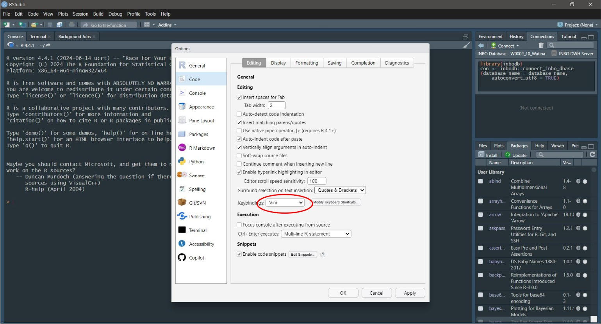

# vim - the text editor you cannot leave.

*An interactive `vim` workshop held at INBO/BMK "praatjes", February 2025.*


https://www.vim.org


When first encountering `vim`, [people have trouble exiting the application.](https://stackoverflow.com/q/11828270).
Once you learn more about it, you might have trouble working without it.


These are my notes for an interactive workshop held at INBO.

It consists of 

1. a brief introduction, mainly filled with references,
2. an interactive tutorial, inspired by `vimtutor` and the like,
3. a quick demo of more advanced functions.


Due to operative constraints, the workshop will happen in "RStudio", using the limited set of vim motions it offers.




If you work in [`vim`](https://www.vim.org), [neovim](https://neovim.io), or other more comprehensive variants, you can work through this tutrial by opening all files as a "buffer":

``` vim
:args *
```

And then navigating through the slides with

``` vim
:bn
:bp
```


Or add a bit more polish by creating your own presentation mode [(see this video by Nick Janetakis)](https://www.youtube.com/watch?v=7fIR55kkTwc) via a `.vimrc` modification.

``` vim-script
" Mappings to make Vim more friendly towards presenting slides.
autocmd BufNewFile,BufRead *.vpm call SetVimPresentationMode()
function SetVimPresentationMode()
  nnoremap <buffer> <Right> :n<CR>
  nnoremap <buffer> <Left> :N<CR>

endfunction

```
